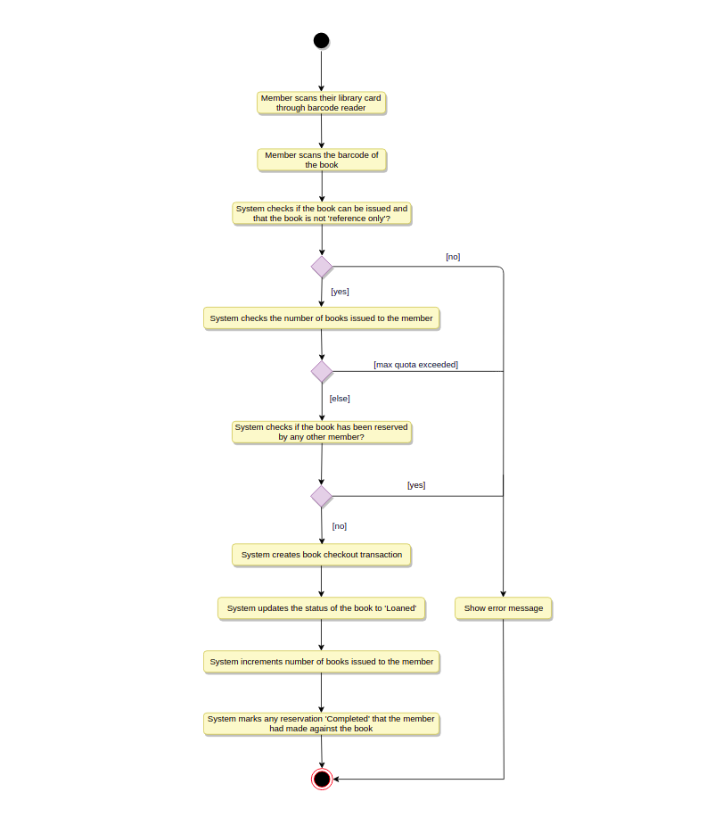
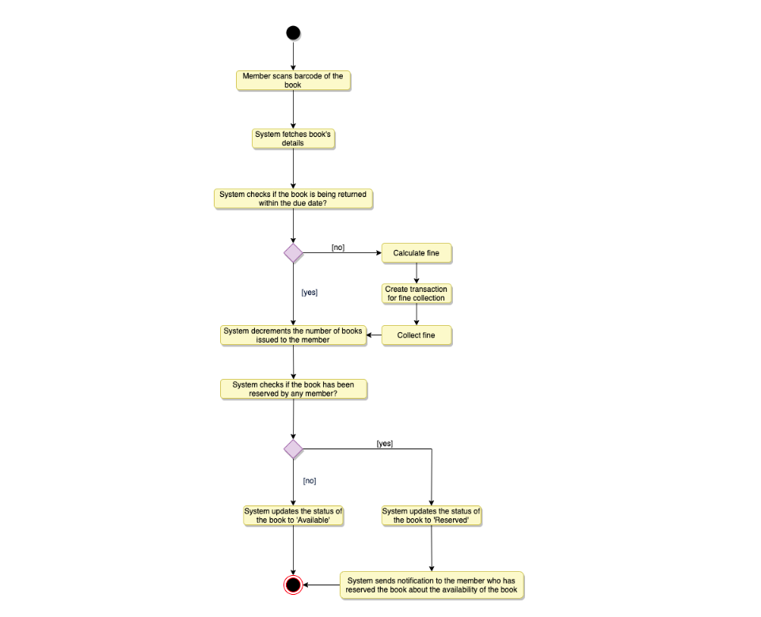
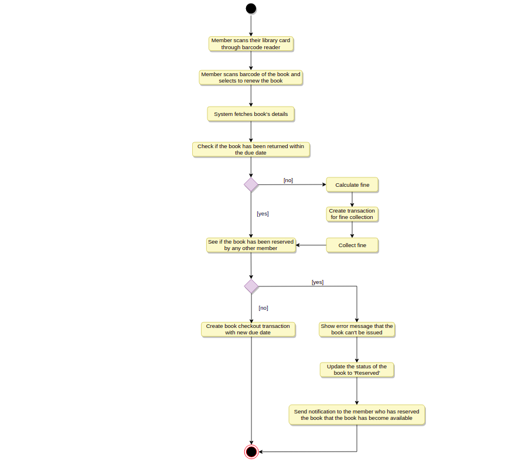

# Activity diagrams

## Check-out a book: 

Any library member or librarian can perform this activity. Here are the set of steps to check-out a book

## Return a book: 

Any library member or librarian can perform this activity. The system will collect fines from members if they return books after the due date. 
Here are the steps for returning a book

## Renew a book: 
While renewing (re-issuing) a book, the system will check for fines and see if any other member has not reserved the same book, in that case the book item cannot be renewed. 
Here are the different steps for renewing a book

